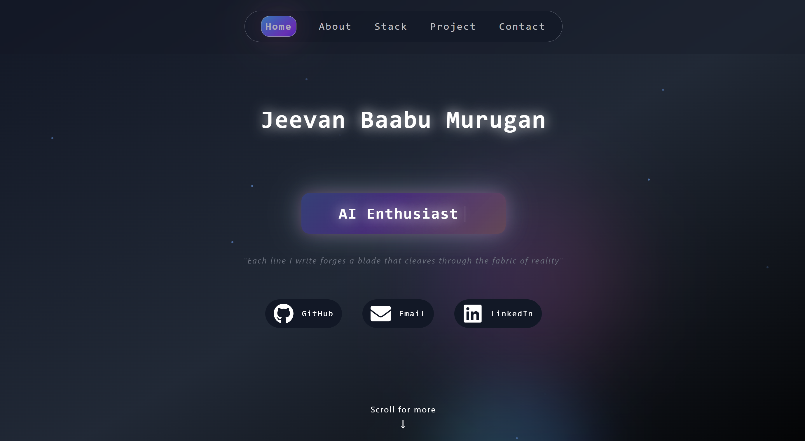

# Jeevan Baabu's Portfolio Website

A modern, responsive portfolio website built with React, showcasing my projects, skills, and experience in web development and AI/ML.



## 🚀 Features

- **Modern UI/UX**: Built with React and Tailwind CSS for a sleek, responsive design
- **Interactive Animations**: Smooth scroll animations and transitions using Framer Motion
- **Dynamic Content**: Showcase of projects, skills, and experience
- **Contact Form**: Integrated contact form for easy communication
- **Responsive Design**: Fully responsive layout that works on all devices
- **Dark Mode Support**: Built-in dark mode for better viewing experience

## 🛠️ Tech Stack

- **Frontend Framework**: React.js
- **Styling**: Tailwind CSS
- **Animations**: Framer Motion
- **Icons**: React Icons
- **Typewriter Effect**: React Simple Typewriter
- **Form Handling**: Formspree
- **Build Tool**: Vite

## 📦 Installation

1. Clone the repository:
```bash
git clone https://github.com/therealgone/Jeevan_Website.git
```

2. Navigate to the project directory:
```bash
cd Jeevan_Website/my-portfolio
```

3. Install dependencies:
```bash
npm install
```

4. Start the development server:
```bash
npm run dev
```

## 🎯 Project Structure

```
my-portfolio/
├── src/
│   ├── components/
│   │   ├── about.jsx
│   │   ├── contact.jsx
│   │   ├── info.jsx
│   │   ├── project.jsx
│   │   └── stack.jsx
│   ├── assets/
│   │   └── [images and icons]
│   ├── App.jsx
│   └── main.jsx
├── public/
└── package.json
```

## 🌟 Key Features

### About Section
- Dynamic typewriter effect for role display
- Social media links with hover animations
- Smooth scroll indicator

### Projects Section
- Interactive project cards with hover effects
- Scroll-triggered animations
- Project descriptions with tech stack details

### Stack Section
- Animated technology cards
- Categorized skills display
- Interactive hover effects

### Contact Section
- Functional contact form
- Form validation
- Success/error notifications

## 🎨 Customization

To customize this portfolio for your own use:

1. Update personal information in the components
2. Replace project images and descriptions
3. Modify the color scheme in the Tailwind config
4. Add or remove sections as needed

## 📱 Responsive Design

The website is fully responsive and optimized for:
- Desktop
- Tablet
- Mobile devices

## 🔧 Development

```bash
# Start development server
npm run dev

# Build for production
npm run build

# Preview production build
npm run preview
```

## 📄 License

This project is licensed under the MIT License - see the [LICENSE](LICENSE) file for details.

## 👨‍💻 Author

**Jeevan Baabu Murugan**
- GitHub: [@therealgone](https://github.com/therealgone)
- LinkedIn: [Jeevan Baabu](https://www.linkedin.com/in/jeevan-baabu-97a19125b/)

## 🙏 Acknowledgments

- [React](https://reactjs.org/)
- [Tailwind CSS](https://tailwindcss.com/)
- [Framer Motion](https://www.framer.com/motion/)
- [React Icons](https://react-icons.github.io/react-icons/)
- [Formspree](https://formspree.io/)

---

⭐ Star this repository if you find it helpful! 
